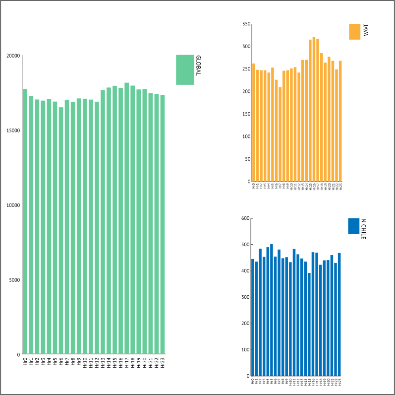
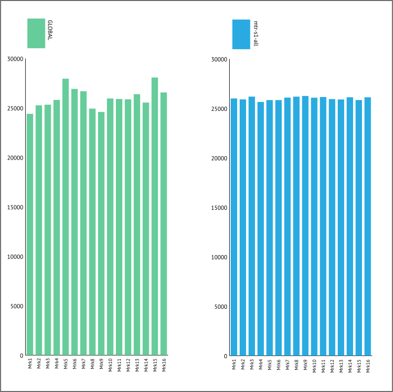

# Extension: By Hour

Reviewing the total population of earthquake events by hour the primary feature of the trend line is a large dip in activity at `Hr06 = 16,497` and a steady increase in activity at it's maximum, 12 hour-categories later at `Hr17 = 18,140`. Remembering that this population represents the totality of global event output, the difference between the high and the low is `1,733` events. This is an approx 10% swing from low to high about the average of `17,338` events per hour-category.

## Alignment At Maximum Hour

Remembering that earthquake timestamps are recorded in the [Coordinated Universal Time zone](https://www.timeanddate.com/time/aboututc.html), if the position of the Sun in relationship to the Earth's surface is recreated at the time of maximum activity (17:00 hours UTC) the respective position of the land masses to the Sun would remain consistent throughout the year (as no allowance is given to "daylights savings" in UTC). The following image shows an approximate representation of this alignment. As this alignment has a daily occurrence, regardless of time of year, a regional population sample of earthquakes from a seismically active area has been included. The conditional coloring indicates that at the time of global peak activity, the regional area _also_ reflects this trend (see green arrow). The low point of activity for this region is 07:00 UTC, which is also temporally proximal to the global low.

## Alignment At Minimum Hour

If the same testing method was made on a region 12 hours later, it can be seen that the activity peak and trough is **reversed** for time in UTC _but consistent respective to Sun-Earth alignment_.

When the Sun is on the opposite side of the Earth from the sampled area, in both cases, there is a corresponding increase in aggregate activity. And, approximately 12 hours later, there is a matching decrease aggregate activity.

## Graph Check

So far the information in the comparative graphs have provided good visual feedback in reviewing the data, but it is possible for scaled graphs to obscure the complete picture. This is due to graph showing only a clipped section of the data results, exaggerates a specific detailed portion. For example the above graphics either only show the isolated trend values (see the location-specific breakouts), or show a conglomerate of trends where the graph value is clipped to an upper range of the total volume and is not complete down to the bottom of '0'.

The following graph is a complete view of the above hourly volumes with no clipping:

As can be seen, the dramatic red trend line seen in the full population hour graph is still evident, but muted compared to the total volume. The trend of volumes of the location breakouts are still dynamic, even showing their full comparison, as they are pulled from a smaller sample base than the full population graph.

Even though the dramatic detail is muted the differences still exist. Looking at the full population by marker, as described on the [Scaled Marker page](../tests/scaled-marker-graphs), the difference is quite clear in the graph:

If the earthquake trend is isolated and expanded to it maximum range, this trend too will become more muted. Even so, comparing it to a similar batch from the pseudo-random examples still shows that the variability is still more apparent in the earthquake population than the pseudo-random population:

