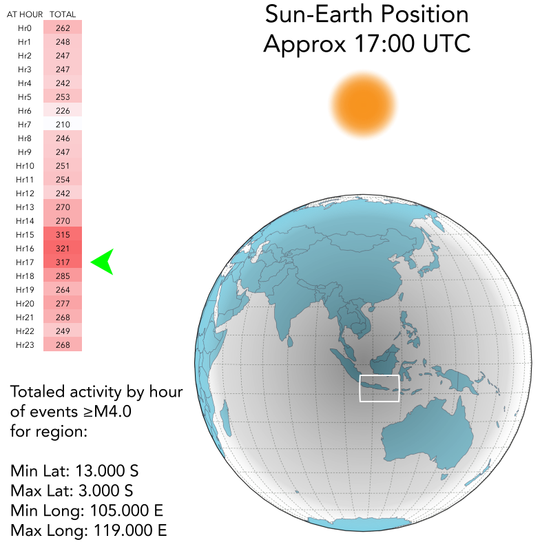

# Extension: By Hour

Reviewing the total population of earthquake events by hour the primary feature of the trend line is a large dip in activity at `Hr06 = 16,497` and a steady increase in activity at it's maximum, 12 hour-categories later at `Hr17 = 18,140`. Remembering that this population represents the totality of global event output, the difference between the high and the low is `1,733` events. This is an approx 10% swing from low to high about the average of `17,338` events per hour-category.

## Alignment At Maximum Hour

Remembering that earthquake timestamps are recorded in the [Coordinated Universal Time zone](https://www.timeanddate.com/time/aboututc.html), if the position of the Sun in relationship to the Earth's surface is recreated at the time of maximum activity (17:00 hours UTC) the respective position of the land masses to the Sun would remain consistent throughout the year (as no allowance is given to "daylights savings" in UTC). The following image shows an approximate representation of this alignment. As this alignment has a daily occurrence, regardless of time of year, a regional population sample of earthquakes from a seismically active area has been included. The conditional coloring indicates that at the time of global peak activity, the regional area _also_ reflects this trend (see green arrow). The low point of activity for this region is 07:00 UTC, which is also temporally proximal to the global low.

## Alignment At Minimum Hour

If the same testing method was made on a region 12 hours later, it can be seen that the activity peak and trough is **reversed** for time in UTC _but consistent respective to Sun-Earth alignment_.

When the Sun is on the opposite side of the Earth from the sampled area, in both cases, there is a corresponding increase in aggregate activity. And, approximately 12 hours later, there is a matching decrease aggregate activity.

---

# Southeast Asia Comparison

## Real vs. Random

The above examples could be said to be less than robust enough to suggest any correlation or causality! To show this, the hour of occurrence for all the earthquake events from 1940 to 2018 (6,279 events) were totaled. Four batches of pseudo-random chance occurrences (6,300 chances per batch) between 0-23 were made and tabled together with the earthquake data for comparison.

As can be seen, the random aggregates can vary as well as create internal patterns, thus making the ragged line seen in [Alignment At Minimum Hour](#alignment-at-minimum-hour) less than a robust comparative element. Statistically the trend does dip at the appropriate time but it is marginal.

If instead we compare five distinct regional profiles in a similar way, by extracting and aggregating the hour value for the same time period, we can see more clearly the trend is mimicked *across regional profiles*. This highly suggests that uniform force is acting upon the events of the _entire_ region. It would be unreasonable to think that this is an isolated force unique to Southeast Asian earthquakes.

To remain skeptical these samples could be tested further by arbitrarily splitting them by month into "summer" and "winter" subdivisions. As can be seen in the following charts, this subdivision does not eliminate the day-low night-high activity trend.

*Event population constrained to only a specific month value for counted entity: April, May, June, July, August or September.*

---

*Event population constrained to only a specific month value for counted entity: October, November, December, January, February or March.*

---