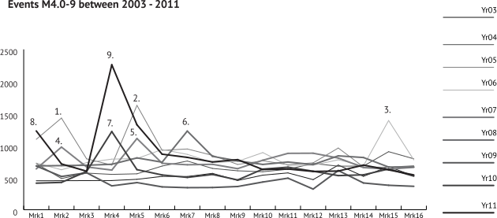

# Extension: M4 Anomaly

Reviewing the scaled graphs an argument could be made that the results could be skewed internally due to aftershocks. After a large seismic event the increase in aftershocks could effect the volume total for a short-term period, the aggregate of which might have influence on the high volatility seen in the scaled graphs. To test this, a graph of the most active years for M4.0-9 events was created using the [marker schedule](../setup/the-marker.md). Activity peaks were identified and an association attempted to a concurrent strong magnitude event.

## Discussion: M4 Anomaly

Skewing due to short-term aftershocks does not appear to happen as the peak marker periods in the [M4 scaled overlay graph](../tests/scaled-marker-graphs.md#m4-sample-population) were Mk5, Mk6, Mk7, & Mk15. The following [graph](#proximal-large-magnitude-events-graph) for the "Proximal Large Magnitude Events" does indicate that greater spikes in activity occurred during the years of 2003-10, but the volume **per marker** does not support the volatility seen in the [M4 scaled overlay graph](../tests/scaled-marker-graphs.md#m4-sample-population). In the following [graph](#proximal-large-magnitude-events-graph), the periods for Mk1 & Mk2 show large spikes of localized activity, but these volumes do not translate to volatility in the associated [M4 scaled overlay graph](../tests/scaled-marker-graphs.md#m4-sample-population). Within the total year range of 2003-10 there were a total of 144 large magnitude events with a minimum magnitude to M7.0. Out of these 144 events less than 10% could be seen to be possibly related to a sudden increase in M4.0-9 activity. Given this, it is not likely that short-term aftershocks have skewed the aggregate results.

### Proximal Large Magnitude Events Graph

### Proximal Large Magnitude Events

1) None (possible overflow from 2004-12-26 **M9.1**, [official20041226005853450_30](https://earthquake.usgs.gov/earthquakes/eventpage/official20041226005853450_30/executive), Sumatra)
2) 2005-03-28 **M8.6**, [official20050328160936530_30](https://earthquake.usgs.gov/earthquakes/eventpage/official20050328160936530_30/executive), northern Sumatra, Indonesia
3) 2006-11-15 **M8.3**, [usp000exfn](https://earthquake.usgs.gov/earthquakes/eventpage/usp000exfn/executive), Kuril Islands
4) 2007-01-13 **M8.1**, [usp000f2ab](https://earthquake.usgs.gov/earthquakes/eventpage/usp000f2ab/executive), east of the Kuril Islands | 2007-01-21 **M7.5**, [usp000f34b](https://earthquake.usgs.gov/earthquakes/eventpage/usp000f34b/executive), Molucca Sea
5) 2007-03-25 **M7.1**, [usp000f7b4](https://earthquake.usgs.gov/earthquakes/eventpage/usp000f7b4/executive), Vanuatu | 2007-04-01 **M8.1**, [usp000f83m](https://earthquake.usgs.gov/earthquakes/eventpage/usp000f83m/executive), Solomon Islands
6) 2008-05-12 **M7.9**, [usp000g650](https://earthquake.usgs.gov/earthquakes/eventpage/usp000g650/executive), eastern Sichuan, China
7) 2010-02-27 **M8.8**, [official20100227063411530_30](https://earthquake.usgs.gov/earthquakes/eventpage/official20100227063411530_30/executive), offshore Bio-Bio, Chile
8) 2010-12-25, **M7.3**, [usp000hrw0](https://earthquake.usgs.gov/earthquakes/eventpage/usp000hrw0/executive), Vanuatu region | 2011-01-01, **M7**, [usp000hsdc](https://earthquake.usgs.gov/earthquakes/eventpage/usp000hsdc/executive), Santiago Del Estero, Argentina | 2011-01-02, **M7.2**, [usp000hsfq](https://earthquake.usgs.gov/earthquakes/eventpage/usp000hsfq/executive), Araucania, Chile
9) 2011-03-11, **M9.1**, [official20110311054624120_30](https://earthquake.usgs.gov/earthquakes/eventpage/official20110311054624120_30/executive), east coast of Honshu, Japan

### Total Large Magnitude Events For Period

|  Magnitude  |    Total   |
| :---------: | :--------: |
| M7.0 - 7.9 | 131 events |
| M8.0 - 8.9 |  11 events |
| M9.0 - 9.9 |  2 events  |
