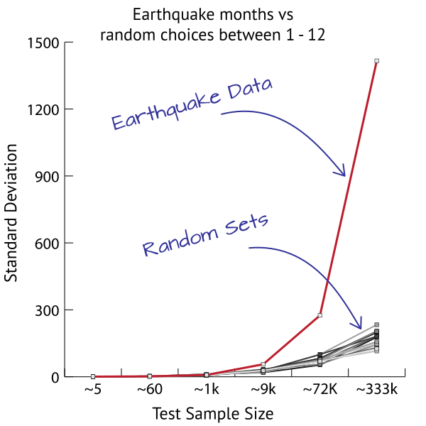
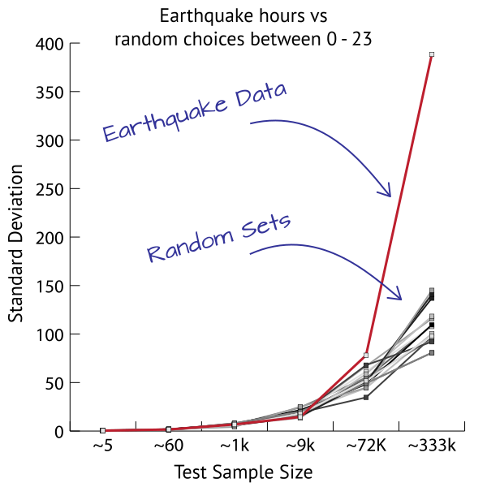
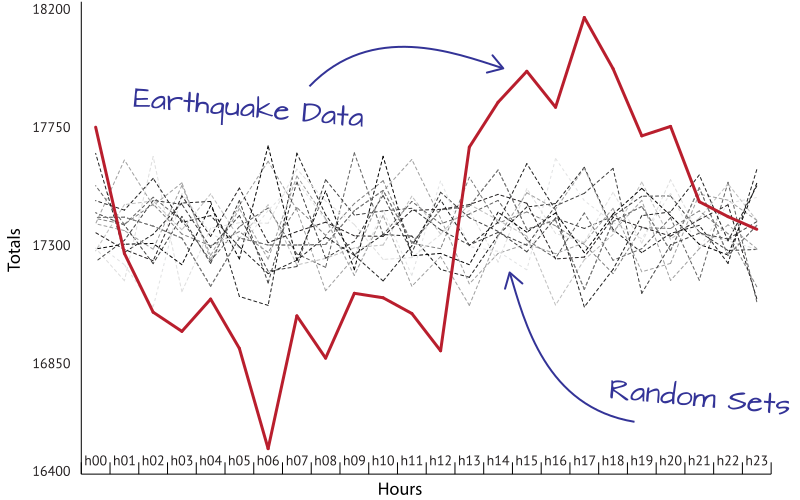

---

# The PEPP Quickstart

### Step 1:
Go to the USGS^[United States Geological Survey] web site and download all the earthquake between 1940 and 2018 with a magnitude of M4.0 or greater. All of them, from anywhere. You'll need at least 300,000 earthquakes to really see what's going on.

### Step 2:
From each earthquake extract the month that it occurred in as a number. January = 1, February = 2, and so on.

### Step 3:
Total up how many times each "month" occurred; how many "1s" you now have, how many "2s", etc

### Step 4:
Now make, for each earthquake, a random number between 1 and 12. If you have 400,000 earthquakes, make 400,000 random choices between 1 and 12. True random number or pseudo-random numbers are both fine, just try and do a good job :smile: 

### Step 5:
Repeat **Step 4** at least 15 times. Try some different generators! :100:

### Step 6:
For each batch of random numbers, apply **Step3**.

### Step 7:
You should now have a set of earthquake totals, and a bunch of set totals for each randomly generated batch.

2) asdf

3) asdf

