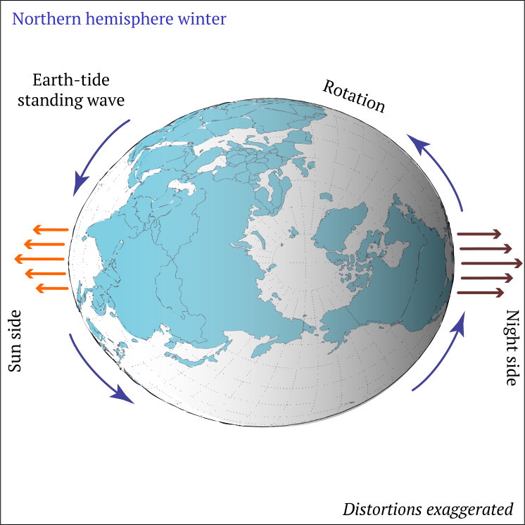
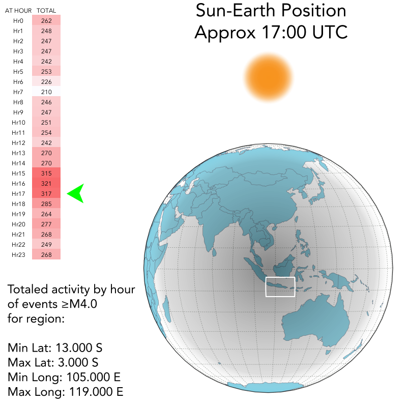
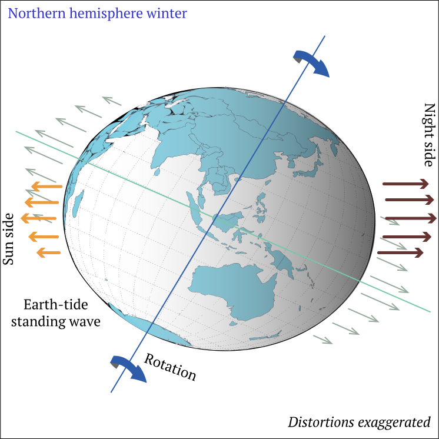
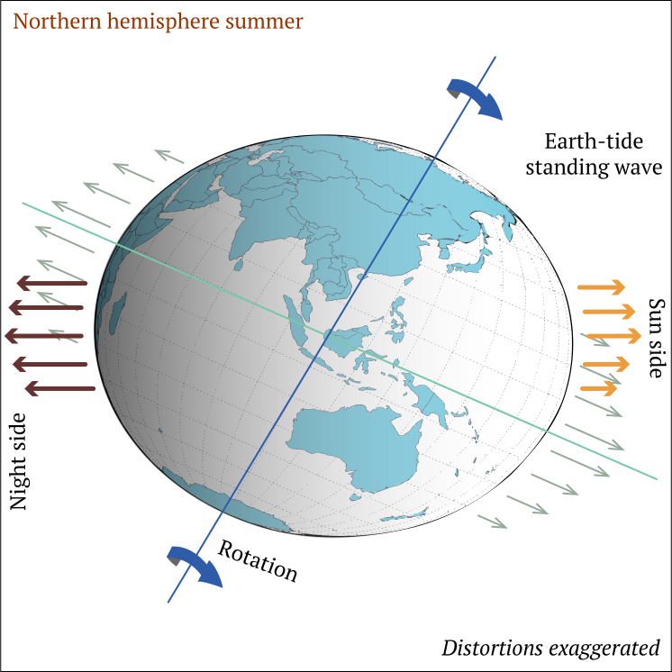
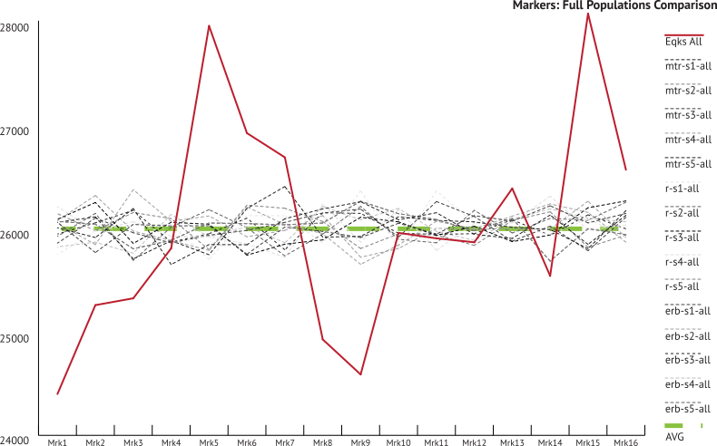

# Mechanism Theory

## Earth Tide as Kinetic Disruptor

::: warning Hey! Read this!
This section is *hypothetical speculation* based on the findings of the research.
:::

## The Solid Earth Tide

The phenomenon of the solid Earth tide may not be a topic that is popularly discussed as much as ocean tides, but in scientific fields requiring high precision measurements of the Earth's surface, such as GPS calibration, Earth tides require not only measurement but conventions of standard calibration[^first]. The displacement of the crust is very slight but enough to cause inaccuracy on distance calculations. Some GPS software even calls for calculating the crustal displacement due to the weight of ocean tides[^second]. While such calculations are well beyond the scope of this research project, it points to a potential mechanism that would explain the results.

As was described previously on the [Findings](../findings/) page _"When the confining pressure is lessened, the faults are unclamped and more likely to slip. The increased probability is a factor of ~3 during high tides."_[^third] This reference appears to point only to the semi-diurnal tides related to oceans. This provides a model to explain near-term seismic behavioral patterns. There is no readily found mention of behaviors as related to Earth-Sun geometries and solid Earth tides. A solar-static Earth tide model would provide a mechanism for seasonal fluctuations in earthquake occurrences.

## Surface Deformations

It is well cataloged that the Earth is not a perfect sphere but an oblate ellipsoid[^fourth] that is slightly enlarged at the equator. As this deformation is caused by the rotation of the Earth's mass (which does not greatly alter) the deformation would remain a fairly constant and consistent distortion. As the rotation is the force generating this deformation, the distribution of this deformation would co-linear or co-planar with the rotation.

A solar-static Earth tide would also be a deformation that is co-linear between the two centers of mass. An Earth tide static to the Sun's gravity would produce an apex, or a center of influence on the Earth's surface. As the Earth rotates, this apex would essentially become a standing wave that the Earth's surface would have to rotate through.

The following image shows an exaggerated hypothetical shape that would be enforced upon the Earth's surface by a solar Earth tide.

- *Blue arrows: Earth's rotation.*
- *Orange arrows: Solar-static tidal forces (tectonic compression; seismic suppression).*
- *Brown arrows: Opposing tidal forces (tectonic decompression; seismic expression).*

---

If we look again at the activity of [earthquakes by hour](../extension/by-hour.md) in a defined seismically active region, this model of a standing-wave Earth tide is supported. When the Earth's surface is opposite to the Sun there is an increase in aggregate earthquake activity. Conversely, when the same area is Sun-side, there is a corresponding decrease in activity.

## Axial Considerations

As the angle of the Earth's rotation axis remains static and decoupled from it's orbital position, this Earth tide apex would not be a consistent feature but change latitude: the apex of the tide would be co-linear between the gravitational centers of the two bodies (Sun and the Earth), and as the position of the Earth progresses through it's annual orbit, so to would the tidal apex change latitude through the year.

### Northern Hemisphere Winter

The following image shows an exaggerated depiction of the axial angle consistent with the northern hemisphere Winter, and southern hemisphere Summer. This position places the co-linear gravitational forces lower in latitude. By extending the behavior seen in the previous hourly example, the tidal apex focus would effect southern latitudes as they rotate through the solar-static Earth tide standing wave, exerting the compressive forces on southern hemisphere faults. Conversely, the northern hemisphere would receive the decompressive forces during this time of year.

- *Blue arrows: Earth's rotation.*
- *Green arrows: Rotational deformative forces.*
- *Orange arrows: Solar-static tidal forces (tectonic compression; seismic suppression).*
- *Brown arrows: Opposing tidal forces (tectonic decompression; seismic expression).*

---

### Northern Hemisphere Summer

Six months later, during the northern hemisphere Summer, the relationship between the rotational angle and the gravitational centers reverses, causing the tidal apex to have migrated north. In turn, the northern latitudes would receive the effects of the Earth tide apex focus, while the southern regions would experience decompressive forces.

- *Blue arrows: Earth's rotation.*
- *Green arrows: Rotational deformative forces.*
- *Orange arrows: Solar-static tidal forces (tectonic compression; seismic suppression).*
- *Brown arrows: Opposing tidal forces (tectonic decompression; seismic expression).*

---

## Seasonal Distribution Anomaly

The transitory position of the solar-static Earth tide could also provide an explanatory mechanism for why *and when* earthquake activity is so variable through the year. Looking at [the marker](../setup/the-marker.md) graph for the [entire analyzed population](../tests/scaled-marker-graphs.md), the trend behavior shows two similar maximums and minimums. Though they are not precisely spaced four markers apart, as would be expected for a perfect match-up with annual solstice and equinox positions, maximum and minimum periods do alternate. This oscillation of activity indicates, in aggregate, that a cycle of build-up-and-release in the energy contained within tectonic fault-systems exists. The regular oscillation for the activity, as well as the proximity of the activity trend extremes being concurrent to Sun-Earth alignments, points to earthquake event **timing** as being non-random and induced or influenced by the relationship between the angular position of Sun-Earth gravity centers and it's effect on the Earth's mass surface deformations.

---

## What next...?

    
    
    

#### Footnotes & References

[^first]: *International Earth Rotational and Reference Systems Conventions* (2010) [www.iers.org](https://www.iers.org/IERS/EN/Publications/TechnicalNotes/tn36.html)
[^second]: *User manual for the Bernese GNSS Software*, Version 5.2 (November 2015), Astronomical Institute of the University of Bern. Section 10.1.3. "Ocean Tidal Loading" [PDF](http://www.bernese.unibe.ch/docs/DOCU52.pdf)
[^third]:[USGS FAQS](https://www.usgs.gov/faqs/can-position-moon-or-planets-affect-seismicity-are-there-more-earthquakes-morningin-eveningat-a?qt-news_science_products=0#qt-news_science_products)
[^fourth]: *Physics of Earth's deformation*, [Wikipedia](https://en.wikipedia.org/wiki/Earth_radius#Physics_of_Earth's_deformation)